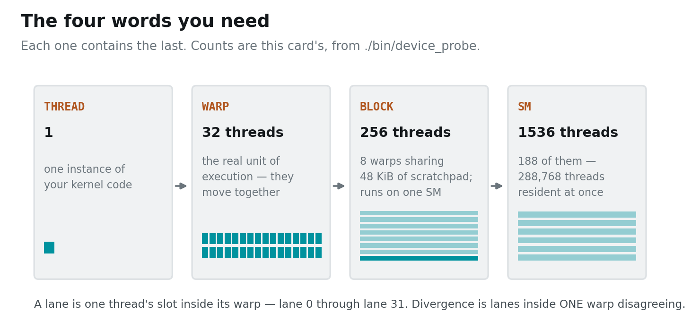
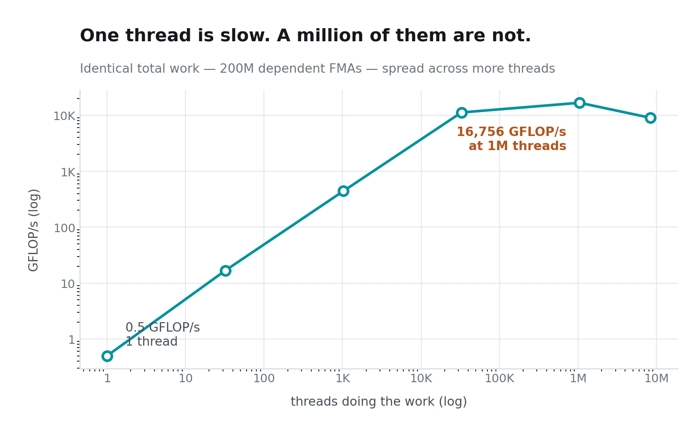
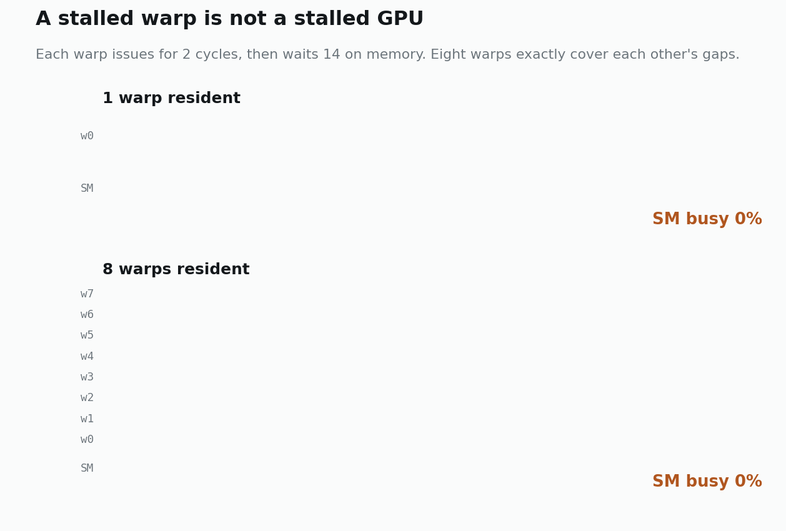
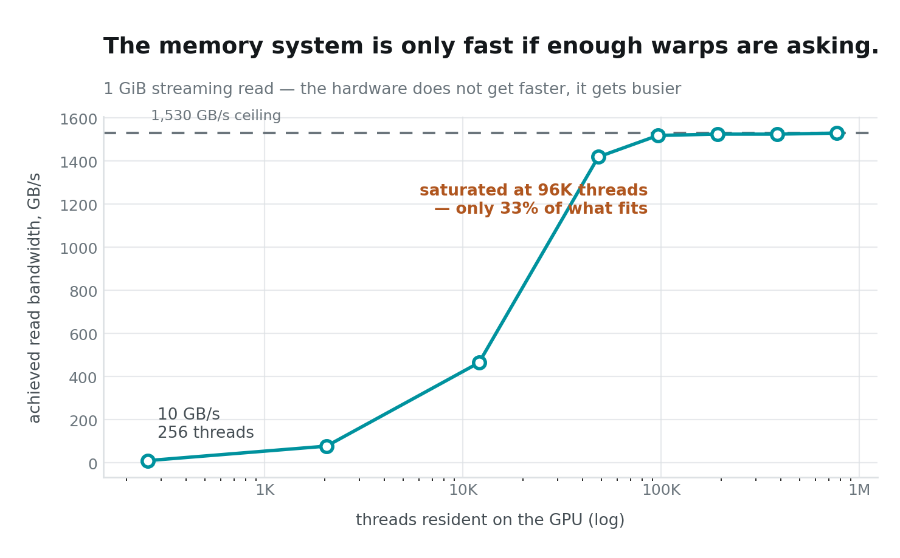
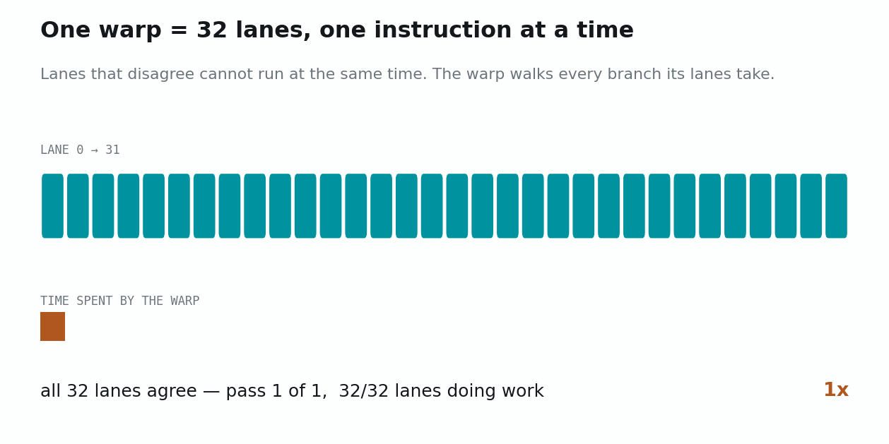
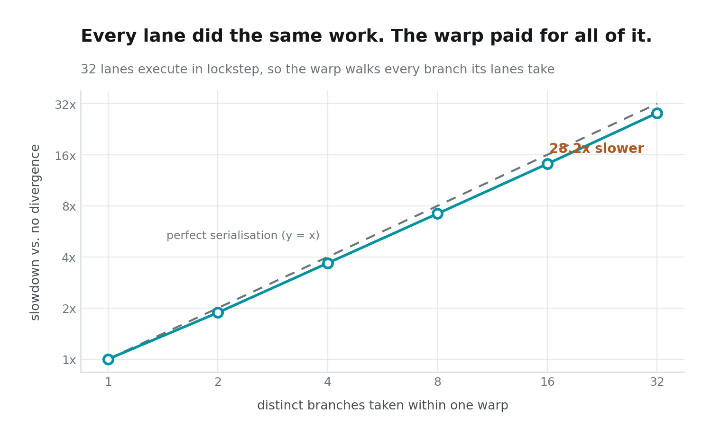

# Your GPU Is Not a Fast CPU

I ran the same loop — 50 million dependent **FMAs** — on one core of an AMD
EPYC 9554, and on one thread of an RTX PRO 6000 Blackwell sitting in the same
chassis.

> An FMA is a *fused multiply-add*: `v = v*a + b`, one multiply and one add
> executed as a single instruction. It is the workhorse of graphics and machine
> learning alike — a matrix multiply is essentially nothing but FMAs — which is
> why it is the fairest single operation to compare across two very different
> processors.
>
> **Dependent** means each FMA needs the previous one's result, so nothing can
> overlap. That makes this a pure *latency* test, chosen deliberately as the
> honest worst case. Give either processor independent work and it will beat
> these figures comfortably — 1.92 ns is not "GPU FMA speed".

```
one GPU thread    96.1 ms    1.92 ns per FMA
one CPU core      53.7 ms    1.07 ns per FMA
```

**The $8,000 accelerator lost by a factor of 1.8.** On my laptop — an M4 Pro —
the same loop runs at 1.33 ns, so the GPU loses there too.

This is not a defect, a misconfiguration, or a bad benchmark. It is the
entire design.

> ### Key takeaway
> **GPU threads are slow *because* there are so many of them.** Not slow *and*
> numerous — slow as the direct price of being numerous. Everything below is
> the receipt for that sentence, and the one catch it comes with.

---

## Instance setup

You need a Linux box with an NVIDIA GPU. **This post runs on one GPU**; posts
04–07 will need two. Everything here was measured on 2× RTX PRO 6000 Blackwell
(sm_120), but any NVIDIA card works.

```bash
# 1. Most rented GPU pods ship a CUDA *runtime*, not a toolkit:
#    no nvcc, no headers. Check first.
which nvcc || echo "no toolkit — run setup_pod.sh"

# 2. Get the code
git clone https://github.com/dharmjit/genai-learnings
cd genai-learnings/gpu-parallelism

# 3. Install the toolkit if step 1 came up empty.
#    (Do NOT just `apt install cuda-toolkit` — see the note below.)
sudo bash setup_pod.sh

# 4. Build
export PATH=/usr/local/cuda-12.9/bin:$PATH
make -j

# 5. This post
./bin/device_probe     # ~10 s
./bin/warp_lab         # ~30 s
```

> **If `apt install cuda-toolkit-12-9` fails with "held broken packages":** the
> image pins `libcublas` to an older version than the repo's dev package
> demands, and the error message names none of that. `setup_pod.sh` pins each
> `-dev` package to the held runtime version. It also warns you if `/dev/shm`
> is the 64 MB Docker default — which will bite you later with PyTorch
> dataloaders and NCCL.

---

## What the machine actually is

Run `./bin/device_probe` and the shape of the thing is immediately clear:

```
compute capability      sm_120
SMs                     188
max threads / SM        1536
shared mem / block      48 KiB
L2 cache                128 MiB
global memory           95.0 GiB
memory bus              512-bit
SM clock                2.43 GHz
```

188 streaming multiprocessors × 1536 threads each = **288,768 threads
resident at once.** Not queued — *resident*, with their registers live on
chip, ready to run on any cycle.

Four words carry the rest of this series. They nest, and once you have them the
vocabulary problem is over:



The one that catches people out is **block**. You choose its size; the hardware
chose the warp size. A block is your unit of organisation — threads in a block
can share a scratchpad and synchronise with each other. A warp is the hardware's
unit of execution, and it is 32 whether you like it or not. Hold on to that
distinction — it is what makes the difference between a branch that costs
nothing and one that costs 28×.

Compare that to the CPUs in the same box: two EPYC 9554s, 128 physical cores,
256 hardware threads between them. The GPU carries roughly **1,100× more
threads in flight**, each one clocked lower and, as we just measured,
individually slower.

That trade is the whole machine. A CPU core spends an enormous transistor
budget making *one* instruction stream fast: deep out-of-order windows, branch
prediction, aggressive speculation, big private caches. A GPU spends almost
nothing on that and buys threads instead.

So the question is never "is a GPU fast?" It is: **do you have enough
independent work to fill it?**

---

## One thread is slow. A million are not.

Here is the same total work — 200 million dependent FMAs — spread across more
and more threads. Nothing about the arithmetic changes. Only the width does.



From 0.5 GFLOP/s to **16,756 GFLOP/s: a 33,000× swing**, on identical work, on
the same silicon, in the same second. The only variable is how many threads
were asked to help.

Notice the right-hand end turning back down. At 8.4 million threads each one
has only 23 FMAs to do, and the cost of creating and scheduling threads starts
to exceed the work they perform. **Parallelism is not free, and there is such a
thing as too much of it** — a theme that returns with a vengeance in post 07,
where a pipeline with too many microbatches gets *slower*.

But if sheer width is what makes a GPU fast, something should be nagging at you
by now.

---

## So why not make the threads fast *too*?

If one thread is slow, and the fix is to run a million of them — why not run a
million *fast* ones and win twice?

Because you cannot afford them. And the price has a number.

### Threads cost silicon even when they aren't running

A thread is **resident** when its state already sits on the chip: its registers,
its program counter. That is what lets the scheduler drop a stalled warp and
pick up another in a single cycle, with nothing to save or reload.

It is also what makes threads expensive. *Every resident thread occupies real
estate whether it is running or not.* `./bin/warp_lab` prints the bill:

```
registers / SM             65536 (32-bit) = 256 KiB
registers / thread          42.7 at full occupancy
register file, whole GPU    47.0 MiB across 188 SMs
```

A CPU core's physical register file is a few kilobytes. **One SM here has
256 KiB, and the card has 47 MiB of it** — in registers, the most expensive
memory a chip can build.

That is where the transistor budget went.

### The budget is fixed, so it is one or the other

Silicon area is finite. You can spend it on:

- **per-thread cleverness** — reorder buffers, branch predictors, load/store
  queues: the machinery that makes *one* instruction stream fast; or
- **per-thread state** — a huge register file, which makes *many* streams
  possible.

They compete for the same square millimetres. A CPU core spends nearly
everything on the first and serves one or two threads. A GPU spends nearly
everything on the second and keeps 1,536 threads live per SM.

**So the slow thread is not a compromise. It is the receipt.** Roughly 43
registers and no out-of-order machinery per thread is exactly what 288,768
resident threads costs.

---

## What all those threads are for

They are there to have somewhere to be while waiting.

A DRAM access costs several hundred cycles. There are only two responses. A CPU
tries to **avoid** the wait — caches, prefetching, speculation, reordering. A
GPU makes no such attempt. It **tolerates** the wait, and simply issues from a
different warp that is ready.



Each warp issues for two cycles, then waits fourteen on memory. One warp leaves
the SM idle 7/8 of the time. Eight warps, staggered, leave it idle never — and
**not one of them got faster.**

### How many threads is "enough"?

Enough to keep the memory system busy — and we can put a number on how slow it
actually is. A **pointer chase** measures it: the next address is the value you
just loaded, so nothing can be prefetched, pipelined or overlapped. One thread,
one outstanding request, over a 1 GiB buffer too big to hide in the 128 MiB L2:

```
idle round-trip latency   158.9 ns   (386 cycles at 2.43 GHz)
```

**386 cycles.** That is how long a warp sits there having asked for a value. It
is the size of the hole the other warps are filling.

So keep adding warps until the memory controllers have no idle moments left:



With 256 threads, **9.6 GB/s**. With 96,000, **1,517 GB/s** — a 158× difference
reading the same gigabyte through the same memory controllers, and it flattens
at roughly a third of the threads the card can hold.

**The memory system did not get faster. It got busier.**

---

## So that's the design

Cheap threads, so you can afford a lot of them. A lot of them, so there is
always one ready to run. Always one ready, so the memory latency never shows.
Every piece pays for the next, and the slow thread is where the money came from.

Launch enough threads and you are done, then?

Almost. Everything above quietly assumed your threads are independent of one
another. **They are not** — and the word doing the damage is one you have
already met.

---

## The catch: your threads are not independent

**Warp.** You have been reading that word for two sections now: 32 threads that
the hardware schedules as one. That togetherness is exactly what makes the last
section work — the SM swaps a stalled warp for a ready one because a warp is the
thing it schedules, not a thread.

Now the bill for it.

A warp executes *one instruction at a time*, applied across all of its lanes
that are currently active. Each thread sits in one **lane** — lane 0 through
lane 31.

That is fine when all 32 lanes agree. When they don't — when some lanes take
the `if` and others take the `else` — the hardware cannot run both at once. It
runs the `if` with the else-lanes switched off, then runs the `else` with the
if-lanes switched off. Both branches execute. Every lane waits through the
branches it didn't take.

Watch what that costs. Every lane below does exactly the same amount of work in
every scenario; the only thing changing is how many *different* branches the
lanes take:



The lit cells are lanes doing useful work. The bar underneath is time. Splitting
the warp four ways doesn't make any lane slower — it makes the warp run four
times.

I measured this by giving every lane exactly the same amount of arithmetic —
1024 FMAs — and only varying how many *distinct branches* the lanes inside a
warp collectively take:



Identical work per lane. **28× slower** when all 32 lanes disagree. The lane
was never the unit of execution; the warp was.

This is why `if (threadIdx.x % 2)` is a performance bug and
`if (blockIdx.x % 2)` is free — the first splits a warp, the second doesn't.

---

## Next

So: slow threads, because there are so many of them; so many of them, because
that is the only way to keep a memory system this slow permanently busy. A GPU
is a throughput machine that has to be fed.

In the next post we find out what actually starves it — and it isn't
arithmetic. I'll show you the same kernel, with the same instruction count, running 4×
faster because of a one-line change to *which thread touches which address* —
and then the same optimisation delivering exactly nothing at a different matrix
size.

**Next: The Memory Wall — Why Your Kernel Is Slow.**

---

*Code: [`genai-learnings/gpu-parallelism`](https://github.com/dharmjit/genai-learnings).
All figures generated from `results/warp_lab.txt` by
`viz/charts/post01_charts.py` — no number in this post was typed by hand.*
