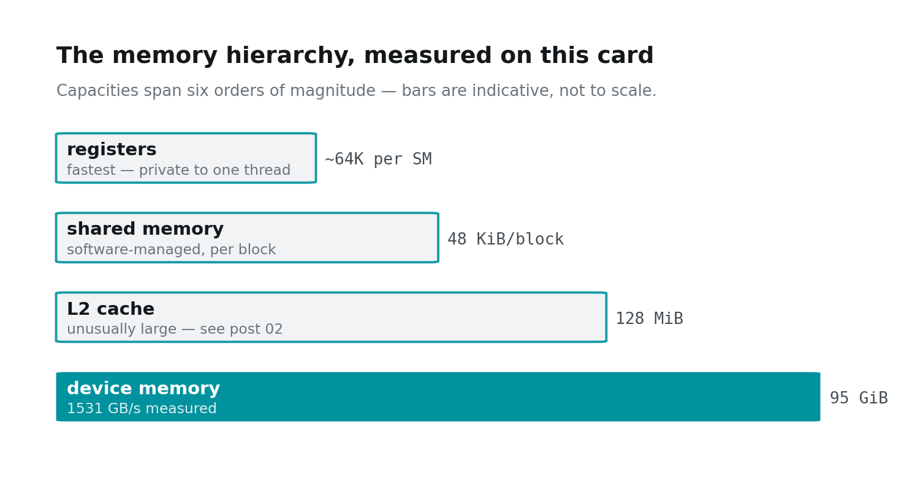
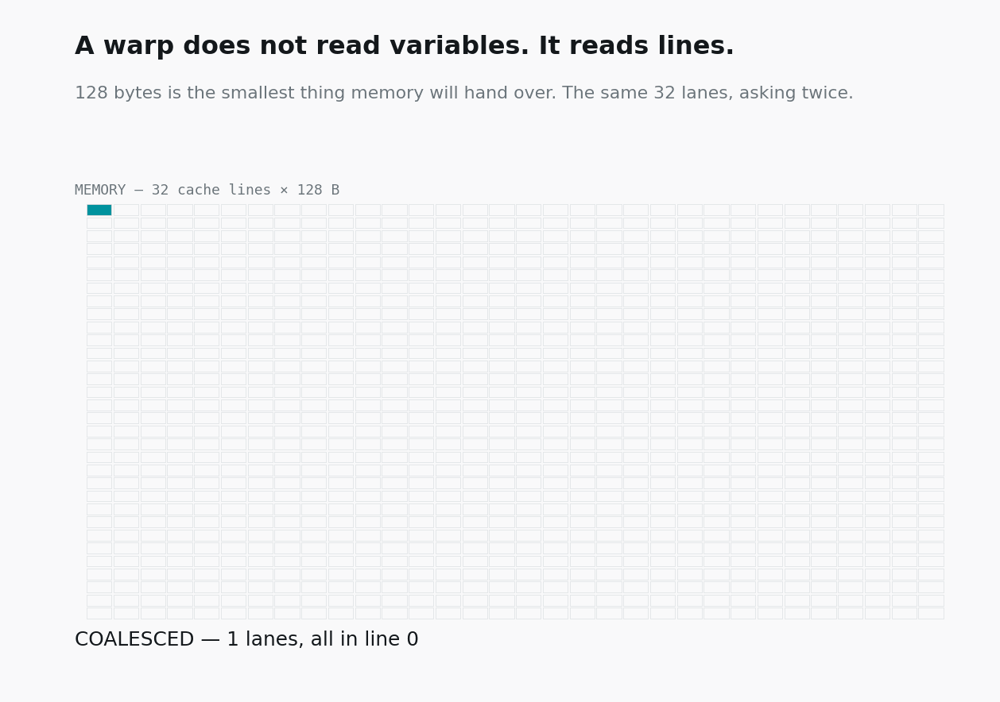
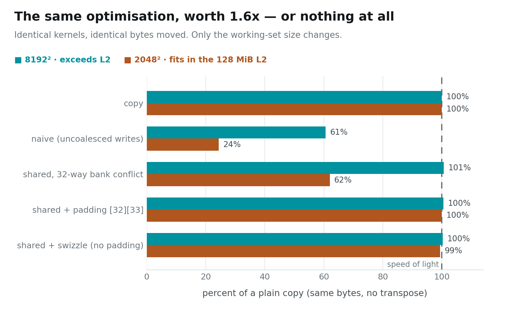

# The Memory Wall — Why Your Kernel Is Slow

Two kernels. Same matrix, same 16 MiB in and 16 MiB out, same instruction
count. One copies it. The other transposes it — which is to say, writes the
identical bytes to different addresses.

```
copy       2048² floats     3308 GB/s
transpose  2048² floats      806 GB/s
```

**Four times slower for writing the same data somewhere else.** Not more data.
Not more arithmetic — there is no arithmetic. Just different addresses.

> ### Key takeaway
> **A GPU does not read variables. It reads 128-byte lines.** Whether your 32
> lanes want bytes from the *same* line or 32 *different* lines is, in a great
> many kernels, the whole performance story.

Post 01 ended on a catch: a warp's 32 lanes must agree about which instruction
to run, or they serialise. This post is the same lesson on a second axis. They
must also agree about **which addresses to touch**.

---

## Instance setup

You need a Linux box with an NVIDIA GPU. **This post runs on one GPU**; posts
04–07 will need two. Everything here was measured on 2× RTX PRO 6000 Blackwell
(sm_120), but any NVIDIA card works.

```bash
# 1. Most rented GPU pods ship a CUDA *runtime*, not a toolkit:
#    no nvcc, no headers. Check first.
which nvcc || echo "no toolkit — run setup_pod.sh"

# 2. Get the code
git clone https://github.com/dharmjit/genai-learnings
cd genai-learnings/gpu-parallelism

# 3. Install the toolkit if step 1 came up empty.
#    (Do NOT just `apt install cuda-toolkit` — see the note below.)
sudo bash setup_pod.sh

# 4. Build
export PATH=/usr/local/cuda-12.9/bin:$PATH
make -j

# 5. This post
./bin/transpose        # ~20 s, runs both regimes
```

> **If `apt install cuda-toolkit-12-9` fails with "held broken packages":** the
> image pins `libcublas` to an older version than the repo's dev package
> demands, and the error message names none of that. `setup_pod.sh` pins each
> `-dev` package to the held runtime version. It also warns you if `/dev/shm`
> is the 64 MB Docker default — which will bite you later with PyTorch
> dataloaders and NCCL.

---

## Memory is not a flat array of bytes

It behaves like one when you write `a[i]`. It is not one.



Every tier there moves data in **fixed-size chunks**, and the chunk is far
larger than your variable. Ask for four bytes and the hardware fetches the
128-byte line containing them, because a line is the smallest thing it knows
how to move. There is no such thing as reading one float.

That is fine — wasteful, but fine — for a single thread. A warp issues one
load instruction on behalf of **32 lanes at once**, and now it matters enormously
whether those 32 addresses land in one line or thirty-two.



Both halves of that loop request exactly **128 bytes of useful data**. The top
half gets it in one transaction and uses all of it. The bottom half triggers
32 transactions, drags in 4096 bytes, and throws away 97% of what it fetched.

When a warp's lanes fall into one line, the hardware merges them into a single
transaction. That merging is called **coalescing**, and it is free when you earn
it and impossible to recover when you don't.

---

## Why a transpose is the perfect victim

A transpose reads `in[row][col]` and writes `out[col][row]`.

Walk a warp through it. Lane 0 to lane 31 have consecutive `col`, so the
**read** is 32 consecutive floats — one line, one transaction, perfect. But the
**write** puts lane *k* at `out[col+k][row]`, and consecutive `col` means
addresses separated by a whole row of the matrix — 2048 floats, 8192 bytes
apart.

Thirty-two lanes. Thirty-two different lines. Every single write.

```
copy (reads coalesced, writes coalesced)     3308 GB/s   100%
naive transpose (writes strided)              806 GB/s    24%
```

There is nothing wrong with the arithmetic in that kernel, because there isn't
any. It is 4× slower purely because of *where* its 32 lanes chose to write.

---

## The fix: transpose somewhere cheaper

You cannot make the output addresses contiguous — the transpose is the whole
point. What you *can* do is stop doing the scatter in DRAM and do it somewhere
that tolerates it.

Shared memory is a scratchpad on the SM itself, a few hundred cycles closer
than DRAM. So:

1. read a 32×32 tile from `in` — **coalesced**, one line per warp;
2. write it into a shared-memory tile;
3. read that tile back **transposed** — the scattered access now happens on
   chip;
4. write it out to `out` — **coalesced** again.

Both DRAM accesses are now perfect. The awkward one happens in a place where
awkward is affordable. That is the standard shape of nearly every memory
optimisation on a GPU: *don't avoid the irregular access, relocate it.*

---

## Shared memory has its own 32

Here is the trap, and it is a good one, because shared memory looks like it
should not have this problem at all.

Shared memory is divided into **32 banks**, four bytes wide, striped across
addresses: bytes 0–3 in bank 0, 4–7 in bank 1, and so on, wrapping every 128
bytes. Each bank serves one address per cycle. Thirty-two lanes hitting thirty-
two *different* banks is one cycle. Thirty-two lanes hitting *the same* bank is
thirty-two cycles.

Now look at the tile. Declare it `tile[32][32]` and row *r* starts at element
`r × 32` — which is bank 0, for every single row. Reading a **column** of that
tile means 32 lanes all hitting bank 0.

A 32-way conflict, in the very buffer we introduced to make things faster.

Two fixes, both one line:

**Pad the row.** `tile[32][33]`. Row *r* now starts at `r × 33`, so consecutive
rows start in consecutive banks and a column spreads across all 32. Costs 32
floats of shared memory per tile.

**Swizzle instead.** Store logical `(r, c)` at physical `[r][(c + r) % 32]`.
Same conflict-free mapping, no wasted memory — which matters, because shared
memory is often what caps how many blocks fit on an SM.

```
shared, 32-way bank conflict     2052 GB/s    62%
shared + padding [32][33]        3308 GB/s   100%
shared + swizzle (no padding)    3287 GB/s    99%
```

Padding and swizzling perform identically. Prefer the swizzle when shared
memory is scarce; prefer padding when you want the code to stay obvious.

---

## Now run the whole thing again at 8192²

Everything above is true. Here is the same set of kernels, unchanged, on a
matrix four times larger in each dimension:



**The bank conflict is free.** 101% of copy — indistinguishable from the fixed
version. The optimisation we just spent a section on buys exactly nothing.

Nothing about the conflict changed. What changed is what the kernel is waiting
for. At 2048² the whole 16 MiB working set lives in the 128 MiB L2, data
arrives fast, and the SM is close enough to compute-bound that a 32-cycle
shared-memory stall is time you actually lose. At 8192² the working set is
256 MiB, every byte comes from DRAM, and the kernel spends so long waiting for
memory that the conflict disappears into the wait.

Coalescing still matters at both sizes — 61% and 24%. It always matters,
because it changes how many bytes cross the bus, not just how long you wait for
them.

> **An optimisation is worth exactly what the current bottleneck allows.** Fix
> the conflict on the small matrix and you gain 1.6×. Fix it on the large one
> and you have spent an afternoon to gain nothing measurable. The kernel is
> identical; only the regime differs.

This is the single most useful habit in GPU work: before optimising anything,
find out what the kernel is currently waiting for. Blackwell's unusually large
128 MiB L2 makes this sharper than on older cards — working sets that would
have been firmly DRAM-bound a generation ago now sit in cache, and the advice
written for those cards quietly stops applying.

---

## Next

A warp wants its 32 lanes to agree — about the instruction, and about the
address. Get both right and you are moving bytes at the speed of the hardware.

Which raises the obvious question: moving bytes fast is not the goal. Doing
arithmetic is. In the next post we stop moving data and start multiplying it,
and find that the same matrix multiply can run at 0.84 TFLOP/s or 281 TFLOP/s
depending on nothing but how many times each loaded byte gets used before it is
thrown away.

**Next: Arithmetic Intensity — Climbing the Matmul Ladder.**

---

*Code: [`genai-learnings/gpu-parallelism`](https://github.com/dharmjit/genai-learnings).
All figures generated from `results/RESULTS.txt` by `viz/` — no number in this
post was typed by hand.*
