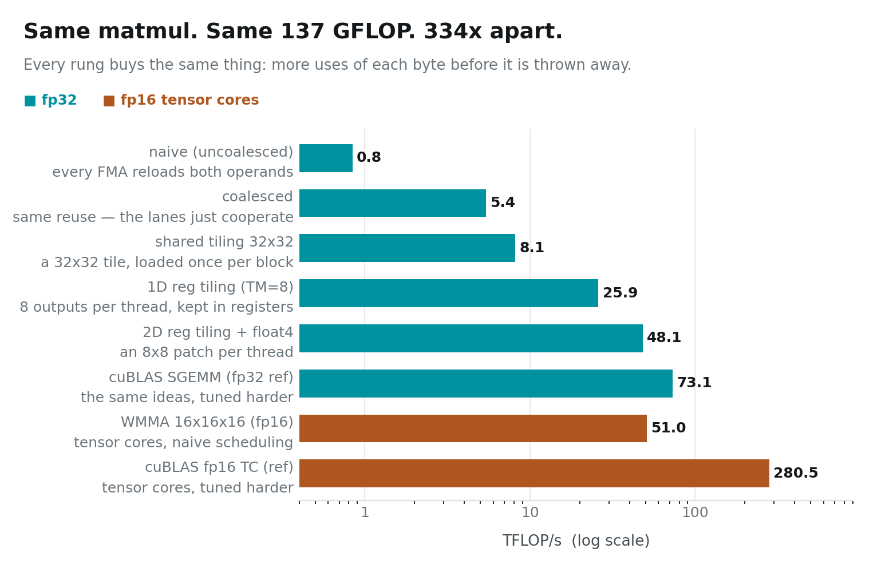

# Arithmetic Intensity — Climbing the Matmul Ladder

Eight programs. All of them multiply the same two 4096×4096 matrices. All of
them do exactly 137 GFLOP of arithmetic and produce the same answer.

```
naive                    0.84 TFLOP/s
cuBLAS, fp16 tensor    280.50 TFLOP/s
```

**334× between the worst and the best**, with the arithmetic held constant.

> ### Key takeaway
> **What limits a GPU kernel is not how many flops it does — it is how many
> flops it does *per byte moved*.** Every rung on this ladder buys the same
> thing: more uses of each value before it is thrown away.

---

## Instance setup

You need a Linux box with an NVIDIA GPU. **This post runs on one GPU**; posts
04–07 will need two. Everything here was measured on 2× RTX PRO 6000 Blackwell
(sm_120), but any NVIDIA card works.

```bash
# 1. Most rented GPU pods ship a CUDA *runtime*, not a toolkit:
#    no nvcc, no headers. Check first.
which nvcc || echo "no toolkit — run setup_pod.sh"

# 2. Get the code
git clone https://github.com/dharmjit/genai-learnings
cd genai-learnings/gpu-parallelism

# 3. Install the toolkit if step 1 came up empty.
#    (Do NOT just `apt install cuda-toolkit` — see the note below.)
sudo bash setup_pod.sh

# 4. Build
export PATH=/usr/local/cuda-12.9/bin:$PATH
make -j

# 5. This post
./bin/matmul           # ~60 s, eight kernels plus verification
```

> **If `apt install cuda-toolkit-12-9` fails with "held broken packages":** the
> image pins `libcublas` to an older version than the repo's dev package
> demands, and the error message names none of that. `setup_pod.sh` pins each
> `-dev` package to the held runtime version. It also warns you if `/dev/shm`
> is the 64 MB Docker default — which will bite you later with PyTorch
> dataloaders and NCCL.

---

## Matmul starts life at 0.25 flops per byte

Write the textbook version and every thread computes one output element:

```c
float acc = 0;
for (int k = 0; k < K; ++k)
    acc += A[row*K + k] * B[k*N + col];
C[row*N + col] = acc;
```

Count what one FMA costs. Two flops. Two loads, four bytes each. That is
**0.25 flops per byte**, and it is a catastrophic ratio.

This card reads memory at about 1531 GB/s and does fp32 arithmetic at roughly
73 TFLOP/s when cuBLAS is driving. Divide those and you get the number that
governs everything here: you need roughly **48 flops for every byte** you move
before arithmetic becomes the thing you are waiting for. At 0.25, the
arithmetic units are idle essentially all the time.

**Arithmetic intensity** is that ratio — flops performed per byte moved — and
the entire ladder below is a campaign to raise it from 0.25 towards 48.



---

## The free rung: stop wasting the bytes you already fetched

The jump from rung 1 to rung 2 is **6.4×**, from 0.84 to 5.40 TFLOP/s, and it
buys no reuse whatsoever. The two kernels move the same values and do the same
FMAs. The only difference is one line:

```c
// rung 1                              // rung 2
int row = blockIdx.x*32 + threadIdx.x; int row = blockIdx.x*32 + threadIdx.x/32;
int col = blockIdx.y*32 + threadIdx.y; int col = blockIdx.y*32 + threadIdx.x%32;
```

In rung 1, consecutive lanes get consecutive **rows**, so a warp reads down a
column of `B` — 32 lanes, 32 different cache lines. In rung 2, consecutive
lanes get consecutive **columns**, so a warp reads one contiguous line.

If you read post 02, you already know this one: it is coalescing. It is worth
repeating because of *where* it sits on the ladder. Before you buy any reuse at
all, before any tiling or clever register work, **make sure you are using the
bytes you have already paid to fetch.** 6.4× for reordering two lines is the
best trade in this post.

---

## The real climb: use each byte more than once

Now the reuse. Each rung keeps a loaded value alive for longer:

**Rung 3 — shared-memory tiling (8.1 TFLOP/s).** A block cooperatively loads a
32×32 tile of `A` and of `B` into shared memory, then every thread in the block
reads them from there. Each element is fetched from DRAM once and used 32
times.

**Rung 4 — 1-D register tiling (25.9 TFLOP/s).** Each thread computes eight
output elements stacked in a column instead of one. A value of `B` pulled into
a register now feeds eight FMAs before being discarded. This is the biggest
single step on the ladder, and it happens entirely in registers — the fastest
storage on the chip, and the one you never explicitly allocate.

**Rung 5 — 2-D register tiling with `float4` loads (48.1 TFLOP/s).** Each
thread owns an 8×8 patch. Now 8+8 = 16 shared-memory reads feed 8×8 = 64 FMAs.
Loads are widened to 128 bits so one instruction fetches four floats.

**Rung 6 — cuBLAS (73.1 TFLOP/s).** The same ideas, tuned harder: bigger tiles,
asynchronous multi-stage pipelining so the next tile is in flight while the
current one computes, and layouts chosen to avoid bank conflicts. Our rung 5
reaches 66% of it, which is a reasonable place for a kernel you can read in one
sitting to stop.

Notice the shape of the climb. Rungs 3 through 5 add no new arithmetic and
remove no work. They just keep each loaded byte alive longer.

---

## Or change what the arithmetic costs

Everything above raises flops per byte. The other lever is to make the flop
itself cheaper.

**Tensor cores** are dedicated matrix-multiply hardware: instead of issuing
individual FMAs, a warp hands the unit a small matrix tile and gets a tile
back. Inputs are fp16, accumulation stays in fp32 so the result does not fall
apart.

```
7  WMMA 16x16x16, hand-written    50.98 TFLOP/s
8  cuBLAS fp16 tensor cores      280.50 TFLOP/s
```

**3.8× faster than the best fp32 path.** That is why mixed precision is not
optional in modern training — it is most of the performance.

The gap between our WMMA kernel and cuBLAS is large and worth being honest
about. Rung 7 shows the API and the mental model: a warp cooperatively owns a
16×16 tile. It does not do the shared-memory staging, the multi-stage async
pipelining, or the swizzled fragment layouts that close the remaining 5×. Those
are real engineering, not a paragraph.

---

## Why there is no roofline in this post

The standard way to draw this is a roofline: arithmetic intensity on one axis,
achieved throughput on the other, with a diagonal memory ceiling and a flat
compute ceiling.

I built one, and then threw it away, because **it was lying**.

The naive kernel has an arithmetic intensity of 0.25. Multiply by 1531 GB/s and
its ceiling should be 0.38 TFLOP/s. It measured **0.84** — comfortably above a
roof it should not be able to reach.

The roofline model assumes every byte comes from DRAM. On this card that
assumption is false. The L2 is **128 MiB**, and the two input matrices are
64 MiB each. The naive kernel re-reads `A` and `B` an absurd number of times,
but most of those re-reads land in cache and never touch DRAM, so its real
traffic is nothing like the model's.

This is the same lesson post 02 ended on, wearing different clothes: an unusually
large L2 quietly invalidates advice that was written when caches were small. Use
the roofline as a way of thinking — *am I short of bytes or short of flops?* —
rather than as a chart you can read a number off.

---

## Next

Three posts in, we have taken one GPU about as far as it goes: feed it enough
independent work, let the lanes agree about instructions and addresses, and
reuse every byte you fetch.

Now we add a second card. In the next post we measure the wire between them and
find it is **13× slower** than the memory already sitting on each GPU — the
single number that shapes every distributed-training decision in the rest of
this series.

**Next: Two Cards, One Wire.**

---

*Code: [`genai-learnings/gpu-parallelism`](https://github.com/dharmjit/genai-learnings).
All figures generated from `results/RESULTS.txt` by `viz/` — no number in this
post was typed by hand.*
