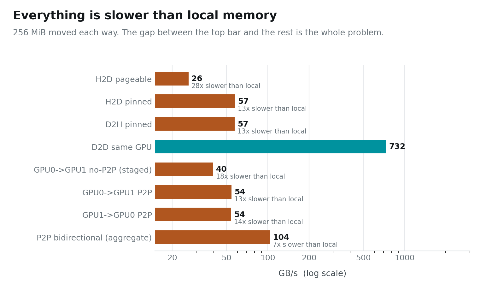
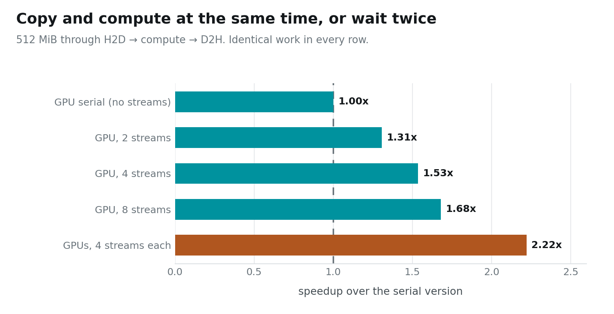

# Two Cards, One Wire

Copy 256 MiB from one place to another on the same GPU, then copy the same
256 MiB to the GPU sitting next to it:

```
within one GPU              732 GB/s
GPU 0 → GPU 1                54 GB/s
```

**Thirteen times slower to cross a gap of a few centimetres.**

> ### Key takeaway
> **The wire between two GPUs is roughly 13× slower than the memory already on
> them.** Every good multi-GPU design is a way of communicating *rarely*, in
> *bulk*, and *overlapped* with work you were going to do anyway.

Posts 01–03 were about one card. This one is the pivot. Everything from here —
data, tensor and pipeline parallelism — is a different answer to the same
question: given that the wire is this slow, what should cross it?

---

## Instance setup

You need a Linux box with **two** NVIDIA GPUs from this post onward. Everything
here was measured on 2× RTX PRO 6000 Blackwell (sm_120), but any pair works —
the code probes peer access at runtime and falls back to host-staged copies.

```bash
# 1. Most rented GPU pods ship a CUDA *runtime*, not a toolkit:
#    no nvcc, no headers. Check first.
which nvcc || echo "no toolkit — run setup_pod.sh"

# 2. Get the code
git clone https://github.com/dharmjit/genai-learnings
cd genai-learnings/gpu-parallelism

# 3. Install the toolkit if step 1 came up empty.
#    (Do NOT just `apt install cuda-toolkit` — see the note below.)
sudo bash setup_pod.sh

# 4. Build
export PATH=/usr/local/cuda-12.9/bin:$PATH
make -j

# 5. This post
./bin/p2p_bandwidth    # ~30 s
./bin/overlap_streams  # ~30 s
```

> **If `apt install cuda-toolkit-12-9` fails with "held broken packages":** the
> image pins `libcublas` to an older version than the repo's dev package
> demands, and the error message names none of that. `setup_pod.sh` pins each
> `-dev` package to the held runtime version. It also warns you if `/dev/shm`
> is the 64 MB Docker default — which will bite you later with PyTorch
> dataloaders and NCCL.

---

## Every path off the chip is slow



One bar is local memory. Every other bar is a way of leaving the chip, and they
are all clustered an order of magnitude below it.

Three things in that chart are worth stopping on.

**Pinned memory is 2.2× faster than pageable, for free.** 57 GB/s against 26.
Pageable host memory can be moved by the OS at any moment, so the DMA engine
cannot be pointed at it — the driver copies your data into a hidden pinned
staging buffer first, then DMAs *that*. You pay for an extra full copy of every
byte. `cudaMallocHost` skips it. If you take one practical thing from this post,
take this one: it is a one-line change.

**Peer-to-peer is worth 36%.** With peer access enabled, GPU 0 writes into
GPU 1's memory directly at 54 GB/s. With it disabled, the same call still
works — but the runtime routes it through host RAM, and you get 40. Note the
failure mode: **nothing breaks, nothing warns you, it is just quietly slower.**

**Both directions at once give 104 GB/s.** PCIe is full duplex, so a transfer
each way costs barely more than one. Algorithms that exchange — every rank
sending while receiving — get this nearly free. Algorithms that take turns do
not.

### What these cards do not have

These are RTX PRO 6000s. They talk over PCIe. **There is no NVLink here**, and
that absence shapes the next three posts more than anything else in this
series — NVLink-class links run several times faster, which is precisely why
tensor parallelism is viable inside a DGX and painful on a box like this one.

When post 06 shows tensor parallelism struggling, this is why.

---

## Hiding the wire behind the work

A slow wire is survivable if you are doing something else while it runs.

The naive shape of a GPU program is three phases in sequence: copy input up,
compute, copy output back. While the copy engine works the SMs idle; while the
SMs work the copy engines idle. **Two thirds of the machine is doing nothing at
any given moment.**

Cut the work into chunks, put each chunk on its own stream, and the phases
overlap — chunk 2 is being copied while chunk 1 computes.



Same 512 MiB, same arithmetic, same hardware. **1.68× from nothing but issuing
the work in eight pieces instead of one.**

The second GPU adds less than you would hope — 2.22× rather than the 3.36× that
doubling a 1.68× would suggest. Both cards pull their input across the same
host bus, so PCIe is now the shared bottleneck rather than either GPU. This is
the first appearance of a theme that runs to the end of the series:
**splitting compute across GPUs is easy, splitting bandwidth is not.**

---

## Two bugs that cost me an afternoon

Both are specific to multi-GPU code, both compile cleanly, and both produce
plausible wrong answers rather than errors.

**Streams on different devices are not ordered against each other.** My first
all-reduce had each GPU's communication stream wait on *its own* compute
stream. That looks right and is wrong: in an all-reduce, GPU 0's copy **reads
GPU 1's buffer**, so it must also wait on GPU 1's compute. Without that, the
copy can start before the data it is copying exists.

The result was not a crash. It was a **6% numerical error**, in one of two
strategies, intermittently — because it depended on which GEMM happened to
finish first. I spent a while suspecting precision before I suspected ordering.

**An event belongs to the device that was current when you created it.** Create
an event under `cudaSetDevice(1)`, record it on a stream belonging to device 0,
and you get `invalid resource handle`. *Waiting* on an event from another device
is fine and is the whole point; *recording* it elsewhere is not.

The general lesson: on one GPU, stream semantics quietly protect you from a lot.
Across two, the guarantees you have been relying on stop applying, and the
compiler cannot tell you.

---

## What this means for everything after

Three numbers now govern the rest of the series:

| | |
|---|---|
| local memory | ~732 GB/s (copy), 1531 GB/s (read) |
| the wire | 54 GB/s one way, 104 GB/s both |
| the ratio | **~13×** |

Every parallelism strategy in the next three posts is a bet about that ratio:

- **Data parallelism** (post 05) sends the *weights* — a fixed cost that
  amortises as your batch grows.
- **Tensor parallelism** (post 06) sends the *activations* — a cost that grows
  with the batch and therefore never amortises.
- **Pipeline parallelism** (post 07) sends the least of all, and pays in idle
  time instead.

Which one wins is not a matter of taste. It follows from that 13×.

**Next: Data Parallelism — Copy the Model, Split the Batch.**

---

*Code: [`genai-learnings/gpu-parallelism`](https://github.com/dharmjit/genai-learnings).
All figures generated from `results/RESULTS.txt` by `viz/` — no number in this
post was typed by hand.*
