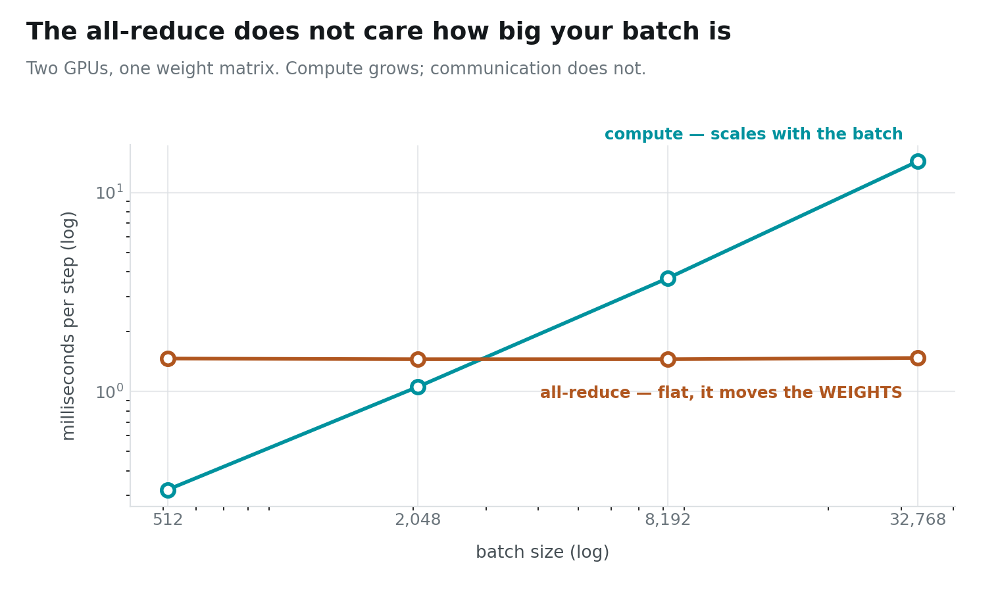
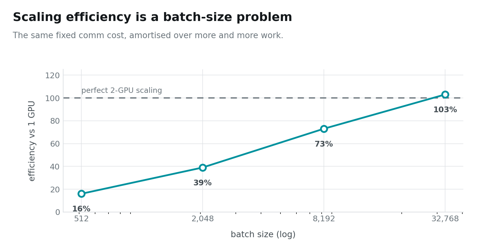

# Data Parallelism — Copy the Model, Split the Batch

One training step, two GPUs, four batch sizes. Watch the last column:

```
batch      compute      all-reduce
   512      0.32 ms       1.46 ms
  2048      1.05 ms       1.45 ms
  8192      3.70 ms       1.45 ms
 32768     14.31 ms       1.47 ms
```

The work grew **45×**. The communication did not move.

> ### Key takeaway
> **Data parallelism communicates the weights, not the data — so its cost is
> fixed.** That single fact is why bad multi-GPU scaling is so often fixed by
> nothing more than using a bigger batch.

---

## Instance setup

You need a Linux box with **two** NVIDIA GPUs. Everything here was measured on
2× RTX PRO 6000 Blackwell (sm_120), but any pair works — the code probes peer
access at runtime and falls back to host-staged copies.

```bash
# 1. Most rented GPU pods ship a CUDA *runtime*, not a toolkit:
#    no nvcc, no headers. Check first.
which nvcc || echo "no toolkit — run setup_pod.sh"

# 2. Get the code
git clone https://github.com/dharmjit/genai-learnings
cd genai-learnings/gpu-parallelism

# 3. Install the toolkit if step 1 came up empty.
#    (Do NOT just `apt install cuda-toolkit` — see the note below.)
sudo bash setup_pod.sh

# 4. Build
export PATH=/usr/local/cuda-12.9/bin:$PATH
make -j

# 5. This post
./bin/dp_matmul         # ~40 s
```

> **If `apt install cuda-toolkit-12-9` fails with "held broken packages":** the
> image pins `libcublas` to an older version than the repo's dev package
> demands, and the error message names none of that. `setup_pod.sh` pins each
> `-dev` package to the held runtime version. It also warns you if `/dev/shm`
> is the 64 MB Docker default — which will bite you later with PyTorch
> dataloaders and NCCL.

---

## The idea, in one line

Give every GPU a **complete copy of the model** and a **different slice of the
batch**.

```
GPU 0:   Y0 = X0 @ W        dW0 = X0ᵀ @ dY0      (first half of the batch)
GPU 1:   Y1 = X1 @ W        dW1 = X1ᵀ @ dY1      (second half)
all-reduce:  dW = dW0 + dW1                      ← the only communication
```

The forward pass communicates **nothing at all**. Each GPU already has every
weight it needs. Only at the end, when both have computed a gradient from
different data, do they need to agree — and agreeing means summing two
matrices that are each exactly the size of the weights.

That is the whole trick, and the whole economics:

```
compute per GPU  =  4 · (B/2) · H · H     ← grows with the batch
communication    =  H · H · 4 bytes       ← fixed, forever
```

---

## Which is why the chart looks like this



Two lines, same axis, same units. One climbs by a factor of 45; the other is a
ruler. They cross at about batch 2500, and everything to the right of that
crossing is where data parallelism starts being worth doing.



**16% → 103%**, from nothing but a larger batch.

At batch 512, two GPUs are *slower than one* — 1.79 ms against 0.57. You spend
1.46 ms synchronising to save 0.25 ms of arithmetic. At batch 32768 the same
1.47 ms is lost in the noise of 14 ms of real work.

That 103% is not a typo and not an error: splitting the batch halves each GPU's
working set, which makes its cache behaviour slightly better than the
single-GPU run. Mildly superlinear, and honest.

---

## What an all-reduce actually is

Two GPUs each hold a gradient. Both need the sum.

```
GPU 0 sends dW0 to GPU 1        GPU 1 sends dW1 to GPU 0
GPU 0 computes dW0 + dW1        GPU 1 computes dW1 + dW0
```

Each GPU sends the buffer once and receives it once. That is it — and at two
GPUs it is already **optimal**. A ring all-reduce across *P* GPUs moves
`2n(P−1)/P` per rank; put P=2 in and you get exactly `n`. There is no cleverer
schedule to find here. The clever schedules start at P=4.

This lab hand-rolls it rather than calling NCCL, because at this scale the
implementation is two peer copies and an add — and seeing that is worth more
than the 20% NCCL would win you.

### The bug that produced plausible wrong gradients

My first version had each GPU's communication stream wait on **its own**
compute stream. That reads as obviously correct and is obviously wrong: GPU 0's
copy *reads GPU 1's buffer*, so it must wait on GPU **1**'s compute too.

It did not crash. It produced a **6% error**, in one of two strategies,
depending on which GEMM finished first. The fix is a cross-device event
barrier; the lesson is that on one GPU stream semantics protect you from a
great deal, and across two they quietly stop.

---

## Where this runs out

Data parallelism is the default strategy for a reason. It communicates the
least of any strategy during the forward pass — nothing — and its one fixed
cost amortises away with scale.

**Its limit is not speed. It is memory.** Every GPU holds the entire model. Two
GPUs give you twice the throughput and *exactly the same* capacity. The moment
your weights do not fit on one card, data parallelism has nothing to offer, and
you have to start cutting up the model itself.

Which is the subject of the next two posts — and where the comfortable
economics of this one fall apart.

**Next: Tensor Parallelism — the Megatron Trick.**

---

*Code: [`genai-learnings/gpu-parallelism`](https://github.com/dharmjit/genai-learnings).
All figures generated from `results/RESULTS.txt` by `viz/` — no number in this
post was typed by hand.*
