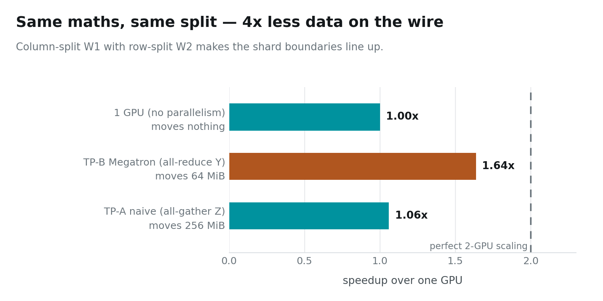

# Tensor Parallelism — the Megatron Trick

Two ways to split the same MLP block across two GPUs. Same maths, same answer,
same number of flops:

```
strategy A — split W1 by column, gather        256 MiB on the wire
strategy B — split W1 by column, W2 by row      64 MiB on the wire
```

**Four times less data for choosing a different pair of cuts.**

> ### Key takeaway
> **Tensor parallelism communicates activations, not weights — so unlike data
> parallelism, its cost grows with the batch and never amortises.** Getting the
> split right decides how much you pay; it cannot make the payment go away.

When the model no longer fits on one card, post 05 has nothing left to offer.
You have to cut up the weight matrices themselves. This post is about the fact
that *how* you cut them is not a detail.

---

## Instance setup

You need a Linux box with **two** NVIDIA GPUs. Everything here was measured on
2× RTX PRO 6000 Blackwell (sm_120), but any pair works — the code probes peer
access at runtime and falls back to host-staged copies.

```bash
# 1. Most rented GPU pods ship a CUDA *runtime*, not a toolkit:
#    no nvcc, no headers. Check first.
which nvcc || echo "no toolkit — run setup_pod.sh"

# 2. Get the code
git clone https://github.com/dharmjit/genai-learnings
cd genai-learnings/gpu-parallelism

# 3. Install the toolkit if step 1 came up empty.
#    (Do NOT just `apt install cuda-toolkit` — see the note below.)
sudo bash setup_pod.sh

# 4. Build
export PATH=/usr/local/cuda-12.9/bin:$PATH
make -j

# 5. This post
./bin/tp_matmul         # ~40 s
```

> **If `apt install cuda-toolkit-12-9` fails with "held broken packages":** the
> image pins `libcublas` to an older version than the repo's dev package
> demands, and the error message names none of that. `setup_pod.sh` pins each
> `-dev` package to the held runtime version. It also warns you if `/dev/shm`
> is the 64 MB Docker default — which will bite you later with PyTorch
> dataloaders and NCCL.

---

## The workload

A transformer MLP block, the most common shape in modern models:

```
Y = GeLU(X @ W1) @ W2

X  [B × H]        W1 [H × 4H]        W2 [4H × H]
```

Two matrix multiplies with a nonlinearity between them. `W1` and `W2` are
512 MiB together — split them and each GPU holds 256.

---

## Strategy A: the obvious one

Cut `W1` into two column-halves. GPU *g* computes its half of the hidden layer:

```
Z_g = GeLU(X @ W1[:, g])          [B × 2H]     no communication
```

So far so good. But the second multiply needs the *whole* of `Z`, so now you
all-gather it, and every GPU redoes the full second GEMM.

That costs twice: **B × 4H of communication**, and a second matrix multiply
that is fully replicated. `W2` is not really split at all — both GPUs need all
of it.

Measured: **1.06×**. Two GPUs, six percent faster than one.

## Strategy B: cut the second matrix the other way

Keep the column-split on `W1`. Split `W2` by **row** instead:

```
Z_g      = GeLU(X @ W1[:, g])     [B × 2H]     no communication
Ypart_g  = Z_g @ W2[g, :]         [B × H ]     no communication
all-reduce Ypart                                ← B × H, once
```

Measured: **1.64×**, moving a quarter of the data, with no replicated compute.



---

## Why B works, and it is not a trick

The reason is worth getting properly, because once you have it Megatron stops
being a recipe you memorise.

`W1` split by column gives each GPU **complete columns** of the hidden layer.
`W2` split by row means each GPU's rows correspond to *exactly those same
columns*. The shard boundaries line up.

Which means what got split is the **contraction dimension** — the index being
summed over. And a contraction split across two machines is just a sum with its
terms in two places. Each GPU computes a partial product over its share of the
inner index, and adding the partials gives the exact answer.

**A split contraction is an all-reduce.** That is the whole insight. Strategy A
splits an *output* dimension, which leaves you needing to reassemble the tensor
before you can use it. Strategy B splits the *summed* dimension, which leaves
you needing only to add.

### The trap that still almost works

The activation function must come **after** the all-reduce.

```
ReLU(a + b)  ≠  ReLU(a) + ReLU(b)
```

Apply the nonlinearity to your partial sum and you get a plausible-looking
tensor of the right shape, full of subtly wrong numbers. Models trained this
way converge — worse, and for no visible reason. There is no shape error to
catch it.

This is why the first GeLU is safe (it operates on `Z_g`, which is *complete*
for those columns) and the second must wait.

---

## The number that should worry you

Strategy B wins on every axis and it still only reaches **1.64×** on two GPUs.

Look at what crosses the wire: `B × H` — an **activation**. Double the batch
and you double the communication. This is exactly the opposite of post 05,
where the all-reduce moved the fixed-size weights and a bigger batch made the
problem go away.

**Tensor parallelism has no batch size that rescues it.** The comm/compute
ratio is roughly constant, so the interconnect sets your ceiling permanently.

Which is why real deployments put tensor parallelism **inside a node**, across
NVLink, and never across it. On this box — two cards on PCIe, 54 GB/s, the
number from post 04 — TP is the weakest of the three strategies. On an
NVLink-connected system, with several times the bandwidth, the same code
becomes competitive. The algorithm did not change. The wire did.

---

## Next

Data parallelism sends the weights and amortises. Tensor parallelism sends the
activations and does not. There is a third option, and it sends less than
either — one tensor per stage boundary, no matter how many layers.

It also introduces a failure mode neither of the others has: GPUs sitting
completely idle while they wait their turn. In the last post we measure that
idle time, watch microbatching shrink it, watch it come *back* when we push too
far — and then put all three strategies on the same workload and see which one
actually wins.

**Next: Pipelines, Bubbles, and When Two GPUs Are Slower Than One.**

---

*Code: [`genai-learnings/gpu-parallelism`](https://github.com/dharmjit/genai-learnings).
All figures generated from `results/RESULTS.txt` by `viz/` — no number in this
post was typed by hand.*
