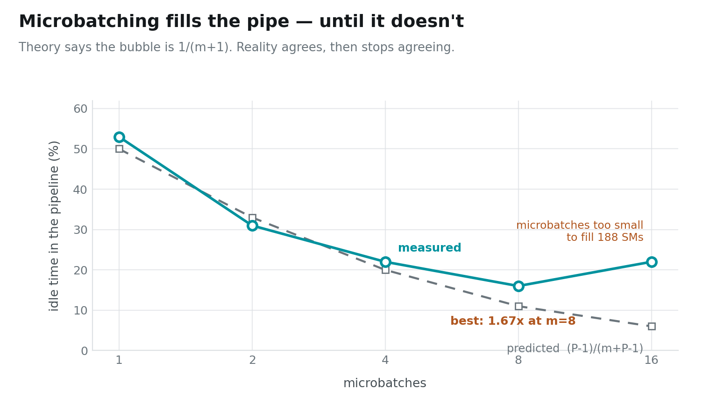
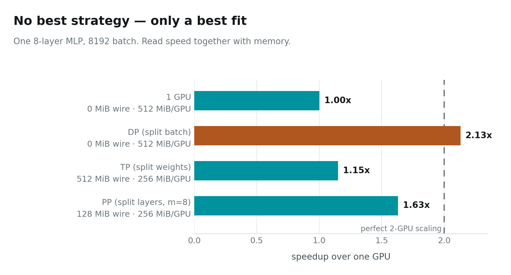

# Pipelines, Bubbles, and When Two GPUs Are Slower Than One

Transpose an 8192×8192 matrix on one GPU. Then split it across two and do it
again:

```
1 GPU                  0.374 ms
2 GPUs, distributed    1.503 ms
```

**Adding a GPU made it four times slower.** Not slightly sublinear. Not
disappointing. Actively worse.

> ### Key takeaway
> **There is no best parallelism strategy — only a best fit for a given model
> size, batch size, and interconnect.** Every strategy in this series wins
> somewhere and loses somewhere, and the wire decides which.

This is the last post. It covers the third strategy, the one failure mode the
other two do not have, and then puts all three on the same workload.

---

## Instance setup

You need a Linux box with **two** NVIDIA GPUs. Everything here was measured on
2× RTX PRO 6000 Blackwell (sm_120), but any pair works — the code probes peer
access at runtime and falls back to host-staged copies.

```bash
# 1. Most rented GPU pods ship a CUDA *runtime*, not a toolkit:
#    no nvcc, no headers. Check first.
which nvcc || echo "no toolkit — run setup_pod.sh"

# 2. Get the code
git clone https://github.com/dharmjit/genai-learnings
cd genai-learnings/gpu-parallelism

# 3. Install the toolkit if step 1 came up empty.
#    (Do NOT just `apt install cuda-toolkit` — see the note below.)
sudo bash setup_pod.sh

# 4. Build
export PATH=/usr/local/cuda-12.9/bin:$PATH
make -j

# 5. This post
./bin/pp_matmul           # ~60 s
./bin/alltoall_transpose  # ~15 s
./bin/mlp_2gpu            # ~60 s
```

> **If `apt install cuda-toolkit-12-9` fails with "held broken packages":** the
> image pins `libcublas` to an older version than the repo's dev package
> demands, and the error message names none of that. `setup_pod.sh` pins each
> `-dev` package to the held runtime version. It also warns you if `/dev/shm`
> is the 64 MB Docker default — which will bite you later with PyTorch
> dataloaders and NCCL.

---

## The third way to cut a model

Data parallelism splits the batch. Tensor parallelism splits each weight
matrix. **Pipeline parallelism splits the model by depth.**

```
GPU 0:  layers 0–3          GPU 1:  layers 4–7
comm:   one activation tensor, at the single boundary between them
```

That is the least communication of any strategy in this series — not per layer,
per *stage boundary*. Eight layers, one handoff. Add eighty more layers and it
is still one handoff.

It also halves the weight memory, exactly like tensor parallelism, and unlike
data parallelism.

So why isn't it the obvious answer?

---

## Because half your machine is doing nothing

Run one batch through and watch. GPU 0 computes layers 0–3 while GPU 1 sits
idle. Then GPU 0 hands over and *it* sits idle while GPU 1 works.

Two GPUs, each busy half the time. **The measured speedup at one batch is
0.95× — slower than a single GPU.**

The fix is microbatching: chop the batch into *m* pieces and feed them in one
after another. Once the pipe is full, both stages work at once. The idle
fraction — the **bubble** — should follow a simple formula:

```
bubble = (P − 1) / (m + P − 1)      P = stages
       = 1 / (m + 1)                for our two stages
```



Theory and measurement agree closely at m = 1, 2 and 4 — 53/31/22% measured
against 50/33/20% predicted. Then they part company, and **m = 16 is slower
than m = 8**.

The formula only counts idle time at the ends of the pipeline. It knows nothing
about the fact that a microbatch of 512 rows produces GEMMs too small to fill
188 SMs, or that every microbatch costs kernel launches. Past m = 8 you are
trading bubble for kernel efficiency, and the trade stops paying.

**That tension is what real pipeline schedulers exist to manage.** GPipe, 1F1B
and interleaved scheduling are all different answers to "how do I shrink the
bubble without making the work too small to be worth doing?"

---

## And sometimes the answer is: don't

Back to the transpose from the top of this post.

Distributing it is straightforward. Each GPU owns half the rows. Transposing
means each GPU keeps its diagonal block and swaps the off-diagonal one with its
neighbour — an **all-to-all**, the pattern behind sequence parallelism, MoE
token routing and distributed FFTs.

```
1 GPU, whole matrix          0.374 ms      1435 GB/s
2 GPUs, distributed          1.503 ms       357 GB/s
   of which: the exchange    1.323 ms
```

**88% of the distributed runtime is the exchange.** A transpose does no
arithmetic — there is nothing to hide the transfer behind. Every byte that
crosses the wire is pure cost against a local operation that was already
running at 1435 GB/s.

All-to-all is also the least forgiving collective there is. An all-reduce can
be arranged as a ring or a tree because partial sums combine; an all-to-all
cannot, because **every byte has exactly one destination**. There is no
schedule that reduces the volume.

Keep this result. "More GPUs is faster" is a belief, and this is the cleanest
counterexample in the series: a memory-bound operation split across a slow link
loses, and loses badly.

---

## All three, one workload

Same 8-layer MLP, same 8192 batch, all three strategies:



Read the speed column **together with** the memory column, because on their own
the numbers are misleading.

**DP wins on speed and communicates nothing** — 2.13×, superlinear. But look at
the memory: 512 MiB per GPU, the same as one GPU. Data parallelism gives you
throughput and no capacity whatsoever. For a model that does not fit, it is not
an option at all.

**PP is second at 1.63×, and moves the least data by far** — 128 MiB against
TP's 512. It halves the weight memory. That combination, low comm and halved
memory, is why pipeline parallelism is the strategy of choice across slow links
and between nodes.

**TP is last here at 1.15×** — and this is the one result that is a property of
*this machine* rather than of the algorithm. TP moves activations, so it needs
bandwidth, and these cards have PCIe. On an NVLink system the same code is
competitive. The algorithm did not change; the wire did.

---

## What the whole series was about

Seven posts, one card to two, and the same idea underneath all of it.

A GPU is a machine for having an enormous amount of work in flight. Everything
about it follows from that: threads are slow because there must be many of
them; they run in groups of 32 that must agree about instructions and
addresses; each byte you fetch must be used many times before it is discarded;
and when one card is not enough, what you send between cards matters far more
than what you compute on them.

The three strategies are three answers to one question — *given a wire 13×
slower than local memory, what should cross it?*

- **Data parallelism** sends the weights. Fixed cost, amortises with batch.
- **Tensor parallelism** sends the activations. Scales with batch, never amortises.
- **Pipeline parallelism** sends one tensor per boundary. Cheapest, pays in bubbles.

Real systems compose all three: tensor parallelism inside a node where the
links are fast, pipeline parallelism across nodes where they are not, and data
parallelism wrapped around the whole thing. Now you know why each one sits
where it does.

Every number in this series came off two RTX PRO 6000s, and the code that
produced them is in the repo. Run it on your hardware. Your numbers will differ
from mine — and the interesting part is always *why*.

---

*Code: [`genai-learnings/gpu-parallelism`](https://github.com/dharmjit/genai-learnings).
All figures generated from `results/RESULTS.txt` by `viz/` — no number in this
post was typed by hand.*
